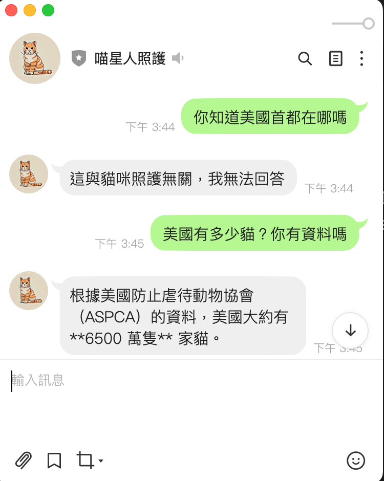
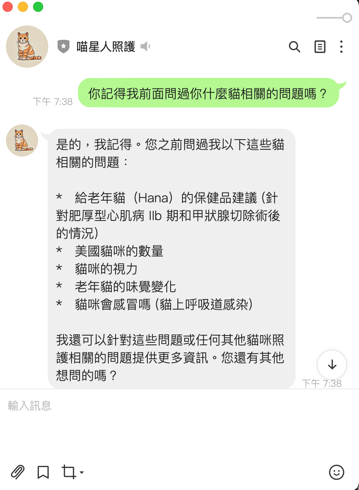

# Linebot integrated with Gen AI for Cat Health Care

A Linebot leveraging Generative AI models to answer cat-related health questions. It uses LangChain and LangGraph to maintain conversation context, with all chat histories stored in MongoDB.

## Demo

linebot id: @742dvcoi 
**This project is deployed on Render.com on a free plan. If no incoming request is received, the service will be shut down until a new request comes in. Consequently, there is a high probability that you may not receive a response to your message on the first attempt, and you might need to try again 6-7 minutes after your first message.**

Users can asking linebot questions. 
- If the question is not related to cat, linebot will responed to the user "It's not related to cat health care. I cannot answer.". 
- If the question is related to general cat question, the linebot will respond accordingly.  
- It the question is related a specific cat "花花", the linebot will use the pre loaded data to answer the question.

<!--  -->


<!--  -->


## Features

- Integrated Linebot Messaging API.
- Responds to cat-related questions using Gemini or OpenAI LLM providers.
- Retains chat history to maintain conversation context.

## Setup

### Development

```bash
# Create a virtual environment
python -m venv .venv
source .venv/bin/activate

# Install dependencies
pip install -r requirements.txt

# Start the server
python -m src.app
```

To end your session, run:

```bash
deactivate
```

### Production

```bash
# Install dependencies
pip install -r requirements

# Start the server using Gunicorn
gunicorn --bind 0.0.0.0:3000 src.app:app
```

## Planned Improvements

- Delete or archive chat history after a specified duration.
- Add more detailed logging.
